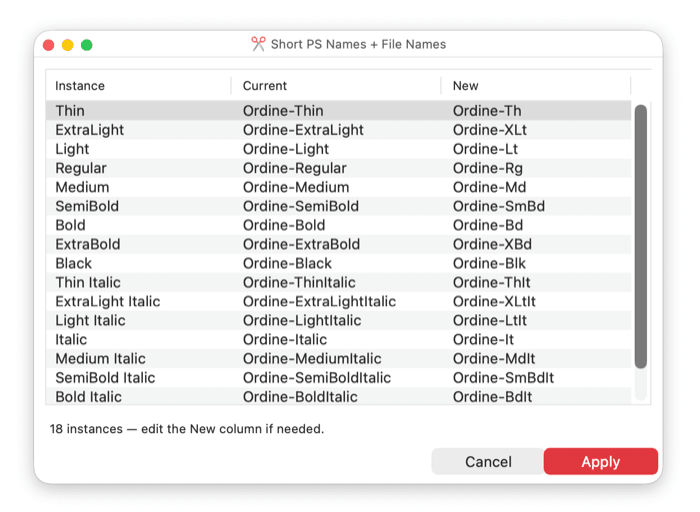

# ✂️ Short Names

By Giuseppe Salerno ([Resistenza Type](https://rsztype.com)).

A script for the [Glyphs font editor](https://glyphsapp.com/). It previews and applies short PostScript font names and file names for every exportable instance, abbreviating each style word (`Condensed` → `Cn`, `ExtraBold` → `XBd`, `SemiCondensed` → `SmCn`, etc.) while leaving the family and style names themselves untouched.

### What it does

Run the script with a font open. It lists every active, non-variable instance with its current PostScript name and a suggested short one (`Family-AbbrStyle`), editable inline before you apply.

The family half comes from the **Typographic Family Name** (name ID 16) whenever one is set, on the instance or on the font, and from the plain family name otherwise. This matters for a family split across several files: with a family name of *Performa Condensed* and a typographic family of *Performa*, the suggestion is `Performa-CnBd` rather than `PerformaCondensed-CnBd`, so the width is not spelled out twice. On **Apply** it sets `postscriptFontName` and the `fileName` custom parameter on each instance, and warns about names that are missing a hyphen, longer than 29 characters, or duplicated — you can still apply anyway.

### Installation

1. Download `ShortNames.py`.
2. Drop it into your Glyphs scripts folder: *Glyphs > Settings… > Addons > Scripts*, or directly into `~/Library/Application Support/Glyphs 3/Scripts/` (or `Glyphs 4/Scripts/`).
3. In Glyphs, open the *Script* menu and choose *Reload Scripts* (⌘⌥⇧Y) if the panel doesn't show up right away.

### Usage

1. Open a font with instances set up in *Font Info > Exports*.
2. Run **✂️ ShortNames** from the *Script* menu.
3. Edit any suggested name in the "New" column if needed.
4. Click **Apply**.

### Requirements

Glyphs 3 or Glyphs 4.

### License

Copyright 2026 Giuseppe Salerno / Resistenza Type [rsztype.com](https://rsztype.com).

You may use, modify, and distribute this script freely. It is provided as-is, without warranty of any kind.
